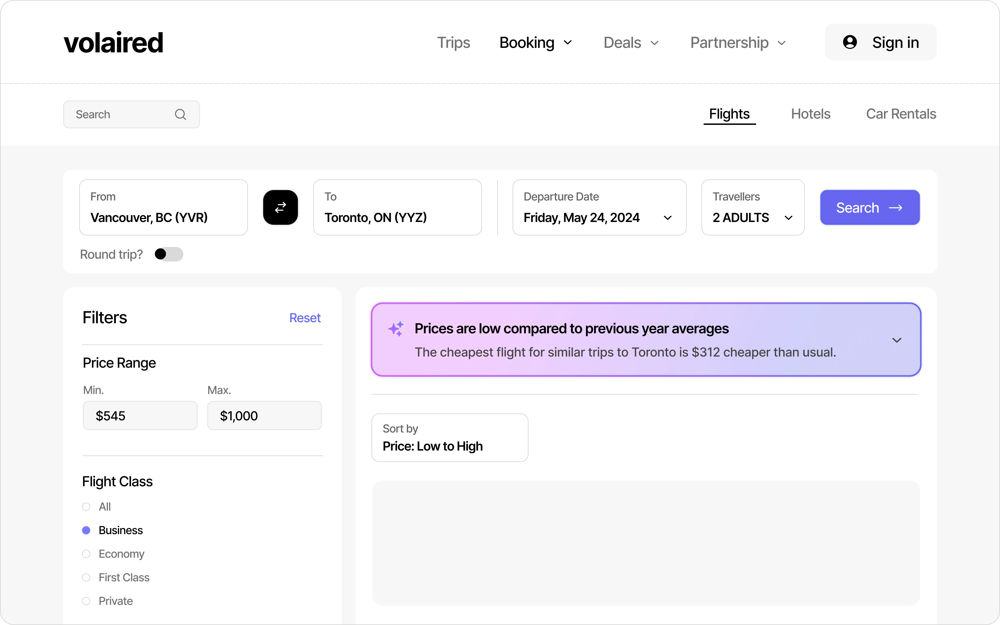
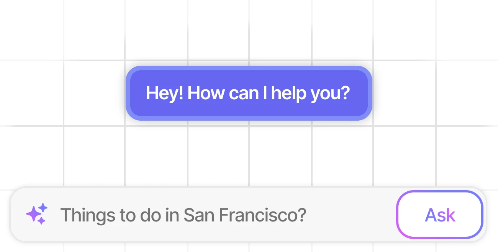
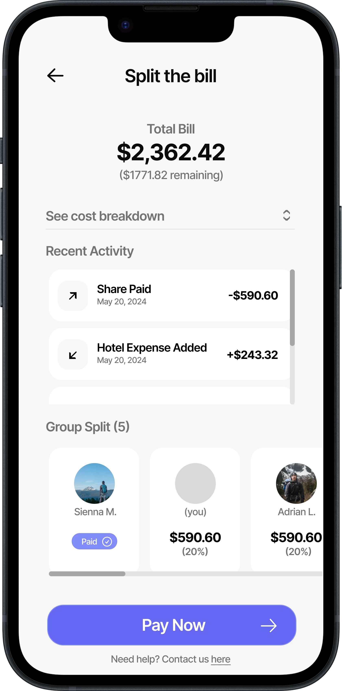

# Volaired

## What This Is

Volaired is a travel-planning web app that combines flight discovery, trip organization, collaboration surfaces, and an assistant-style chat flow. The repo includes authenticated app routes, trip creation flows, search-oriented UI, and a streaming chat endpoint rather than just a landing page.

## What Works

- Landing and marketing pages
- Sign-in, password recovery, profile setup, and auth callback routes
- Flight search UI with filters, mocked result rendering, and airport/date state handling
- Trip pages, trip creation flow, and trip detail routes
- Streaming chat endpoint under `/api/chat`
- Search-oriented components and Supabase-backed app plumbing

## How It's Built

- Next.js + TypeScript app-router project
- Supabase auth/server utilities under `src/lib/supabase`
- Route groups for auth, default app surfaces, and no-footer trip flows
- Search and UI primitives across `src/components`
- AI SDK chat route in [src/app/api/chat/route.ts](./src/app/api/chat/route.ts)

## Technical Notes

- The repo goes beyond a single marketing page: it has separate route groups for auth, flight search, trip creation, and trip detail experiences.
- Flight search currently uses mocked result data in the UI layer, which makes the search and sorting interactions reviewable without requiring a live flight-provider integration.
- The assistant layer is implemented as a streaming route rather than static copy, which makes the repo more useful as a product/system prototype.

## Proof of Work

- Flight search demo asset: 
- Chat/copilot asset: 
- Collaboration asset: 
- Implemented routes include `/(default)/flights/search`, `/(no-footer)/trips/create`, `/(no-footer)/trips/[uuid]`, and `api/chat`

## Run Locally

```bash
npm install
npm run dev
```
