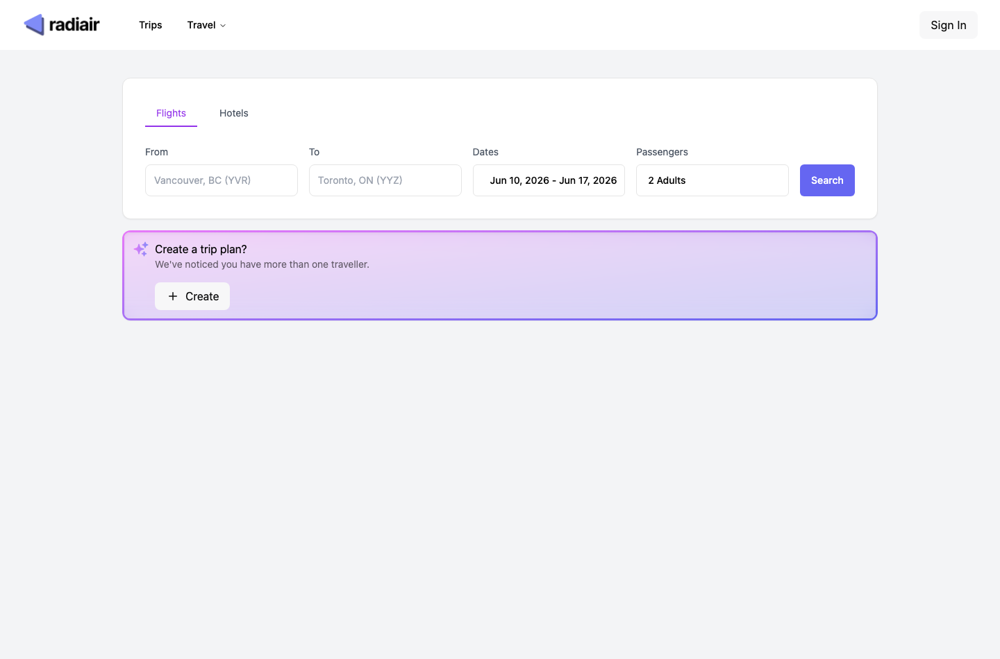
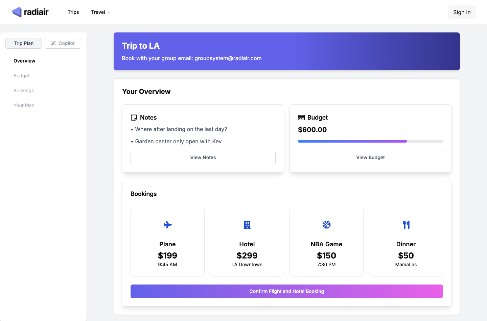

# Volaired

Full-stack travel planning prototype for flight discovery, group-trip coordination, and AI-assisted planning workflows.

## Preview





## Overview

Volaired is a travel planning product that combines flight discovery, trip coordination, and AI-assisted travel workflows in one web experience. The product direction centers on helping users optimize flights, organize group trips, and manage planning tasks without bouncing across multiple tools.

The current UI is branded as Radiair in parts of the app. I kept the repo name as Volaired while exploring the product direction and interface.

## Stack

- Next.js
- TypeScript
- Tailwind CSS + component primitives
- Supabase
- Algolia
- OpenAI / AI SDK integrations
- Python sidecar server for local backend workflows

## What I Built

- A polished multi-page travel product shell
- Flight and trip-oriented UI flows
- Group-trip coordination concepts
- AI/copilot-style assistance inside the product experience
- Supabase-backed auth and data plumbing
- Search and filtering support for travel workflows
- Trip dashboard views for itinerary notes, budgets, bookings, and planning state
- A local Python sidecar path for backend experimentation

## Highlights

- Full-stack app structure with Next.js, Supabase, search, and AI SDK integrations
- Product surfaces beyond a landing page: flight search, trip creation, and trip dashboard
- Group-trip planning concepts such as shared booking email, budget tracking, and itinerary state
- Strong frontend execution with reusable component primitives and motion-driven UI

## Why I Built It

Travel planning is fragmented by default. This project explores what happens when booking, coordination, and assistant-style guidance live inside the same product instead of being split across tabs and tools.

## Outcome

The repo shows strong frontend product execution and a broader platform direction beyond a landing page. It is a useful portfolio piece for modern web UI, product design, and integration-heavy application work.

## Run Locally

```bash
npm install
npm run dev
```

Then open `http://localhost:3000`.

Some flows expect public Supabase and Algolia environment variables:

```env
NEXT_PUBLIC_SUPABASE_URL=
NEXT_PUBLIC_SUPABASE_ANON_KEY=
NEXT_PUBLIC_ALGOLIA_APPLICATION_ID=
NEXT_PUBLIC_ALGOLIA_SEARCH_API_KEY=
```
